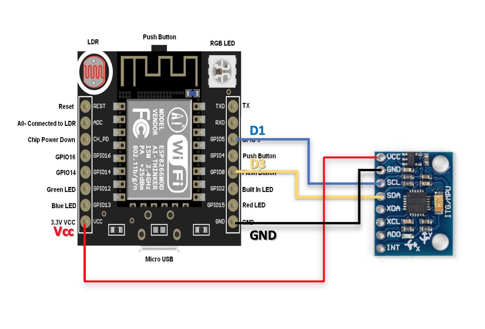

# Python-Flask-Server-For-Esp32-12fWitty-cloud

# Installation 
> pip install -r requirements.txt

# Configuration :
* open config.ini and change the LOCAL_ADDRESS= to the ip in which youe NodeMCU server is running
* > RNG value inorder to change the number of sequency of data : under [variable]

# Model Generation Code:
> https://github.com/Jhilam2014/LSTM-model-Gyroscope-sensor-data-analysis

# Code for NodeMCU Witty Cloud 
> https://github.com/Jhilam2014/Esp3212fGyroSensorDataCollection

# Circuit Diagram for Witty cloud and Gyroscope Sensor

